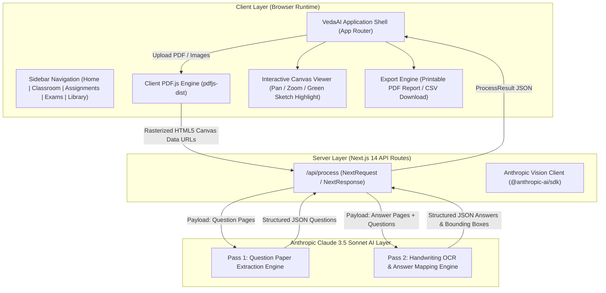

# ScriptSenseAI — AI Assessment Extraction & Answer Mapping Platform

[](https://script-sense-ai.vercel.app/)
[](https://github.com/Reethikaa05/ScriptSenseAI)

<p align="left">
  <a href="https://script-sense-ai.vercel.app/"></a>
  <a href="https://nextjs.org/"></a>
  <a href="https://www.typescriptlang.org/"></a>
  <a href="https://tailwindcss.com/"></a>
  <a href="https://www.anthropic.com/"></a>
  <a href="https://www.framer.com/motion/"></a>
  <a href="https://opensource.org/licenses/MIT"></a>
</p>

**ScriptSenseAI** is an AI-powered handwritten answer evaluation platform designed for educators to upload **question papers** and **handwritten student answer sheets**. Powered by **Anthropic Claude 3.5 Vision AI**, the platform automatically extracts questions, transcribes handwritten answers (even out of sequence), maps answer regions with coordinate bounding boxes, draws interactive highlight annotations, and generates holistic grading analytics.

- 🌐 **Live Website**: [https://script-sense-ai.vercel.app/](https://script-sense-ai.vercel.app/)
- ⭐ **Official Repository**: [https://github.com/Reethikaa05/ScriptSenseAI](https://github.com/Reethikaa05/ScriptSenseAI)

---

## 🏗️ System Architecture

### 📊 End-to-End System Architecture Diagram



---

## 🛠️ Data Pipeline Architecture

```
┌────────────────────────┐
│ 1. Upload & Rasterize  │ ──► Client-side PDF.js converts PDF/Images to 800px Data URLs.
└────────────────────────┘
            │
            ▼
┌────────────────────────┐
│ 2. Pass 1 Extraction   │ ──► Claude 3.5 Vision extracts printed question text & max marks.
└────────────────────────┘
            │
            ▼
┌────────────────────────┐
│ 3. Pass 2 OCR & Map    │ ──► Claude transcribes handwriting, maps questions out-of-order,
└────────────────────────┘     and returns 0.0-1.0 normalized coordinates.
            │
            ▼
┌────────────────────────┐
│ 4. Interactive Canvas  │ ──► Renders green rounded highlight box with pinned [Q2] badge pill
└────────────────────────┘     and smooth auto-scroll to answer region.
```

### 1. Client-Side Rasterization Pipeline (`lib/pdfToImages.ts`)
- Accepts PDF files or raw images (`.png`, `.jpg`, `.webp`).
- Utilizes `pdfjs-dist` inside an isolated browser environment with `typeof window !== "undefined"` guards to maintain SSR build safety.
- Converts every PDF page into a high-resolution 800px base64 HTML5 Canvas Data URL.

### 2. Pass 1: Question Extraction Engine (`lib/claudeExtract.ts`)
- Sends question paper page images to Claude 3.5 Sonnet Vision.
- Identifies questions in printed sequence.
- Preserves sub-parts (e.g. `11 (a)`, `11 (b)`) as distinct entries.
- Returns JSON array containing `id`, `number`, `text`, `maxMarks`, and `page`.

### 3. Pass 2: Handwriting OCR & Answer Mapping Engine (`lib/claudeExtract.ts`)
- Sends answer sheet page images along with extracted questions list.
- **Handwriting OCR**: Transcribes cursive and handwritten text.
- **Out-of-Order Mapping**: Matches answer blocks to question numbers even when written non-sequentially on the paper.
- **Bounding Box Normalization**: Returns `x`, `y`, `width`, and `height` as normalized ratios ($0.0$ to $1.0$) relative to page dimensions.
- **Diagnostic Feedback**: Generates per-question feedback, marks awarded, handwriting legibility percentage, and topic tags.

### 4. Interactive Highlight Canvas (`components/AnswerSheetViewer.tsx`)
- Renders SVG & Image layers with pan/zoom controls ($50\%$ to $250\%$).
- Converts normalized bounding boxes into responsive absolute pixel percentages.
- Animates a green sketch rounded rectangle box (`border-emerald-500 bg-emerald-500/10`) with a pinned `[ Q2 ]` badge pill at top-left matching Figma specifications.

---

## 🧩 Component Architecture Matrix

| Component | Path | Description & Purpose |
|---|---|---|
| **Application Shell** | [app/page.tsx](file:///c:/Users/Dell/Downloads/markscheme-ai-assessment/app/page.tsx) | Main layout router integrating Sidebar, TopHeader, UploadZone, ProcessingScreen, and ResultsView. |
| **Navigation Sidebar** | [components/Sidebar.tsx](file:///c:/Users/Dell/Downloads/markscheme-ai-assessment/components/Sidebar.tsx) | Collapsible navigation sidebar (240px expanded / 64px collapsed), AI Teacher's Toolkit button, and DPS school crest card. |
| **Top Navigation Header** | [components/TopHeader.tsx](file:///c:/Users/Dell/Downloads/markscheme-ai-assessment/components/TopHeader.tsx) | Top breadcrumbs, interactive Notifications popover bell, AI sparkles button, and Madhur Rastogi real avatar photo. |
| **Notification Popover** | [components/NotificationPopover.tsx](file:///c:/Users/Dell/Downloads/markscheme-ai-assessment/components/NotificationPopover.tsx) | Real-time dropdown menu with unread badges, mark-all-read action, and navigation shortcuts. |
| **Upload Zone** | [components/UploadZone.tsx](file:///c:/Users/Dell/Downloads/markscheme-ai-assessment/components/UploadZone.tsx) | Drag-and-drop file upload cards with PDF file preview pills, file size, page count, and clear buttons. |
| **Processing Loading Screen** | [components/ProcessingScreen.tsx](file:///c:/Users/Dell/Downloads/markscheme-ai-assessment/components/ProcessingScreen.tsx) | Animated glowing orange sparkle star icon and multi-stage extraction progress badge. |
| **Answer Sheet Viewer** | [components/AnswerSheetViewer.tsx](file:///c:/Users/Dell/Downloads/markscheme-ai-assessment/components/AnswerSheetViewer.tsx) | Interactive pan/zoom canvas, auto-scroll to highlight, green sketch rectangle, and pinned `[Q2]` badge pill. |
| **Question Card** | [components/QuestionCard.tsx](file:///c:/Users/Dell/Downloads/markscheme-ai-assessment/components/QuestionCard.tsx) | Question item with dark number circle, score pills (`2/2`, `0/2`), and expandable AI Feedback card. |
| **Grading Summary** | [components/GradingSummary.tsx](file:///c:/Users/Dell/Downloads/markscheme-ai-assessment/components/GradingSummary.tsx) | Diagnostic summary gauge stamp, grade outcome progress bar, strengths & focus areas. |
| **Home Dashboard** | [components/HomeView.tsx](file:///c:/Users/Dell/Downloads/markscheme-ai-assessment/components/HomeView.tsx) | Welcome hero banner for Madhur Rastogi, classroom performance stats, recent grading sessions. |
| **Classroom Roster** | [components/ClassroomView.tsx](file:///c:/Users/Dell/Downloads/markscheme-ai-assessment/components/ClassroomView.tsx) | Classroom student roster with real avatar photos, attendance stats, performance filters (*Top Performers, Needs Review*). |
| **Assignments Workspace** | [components/AssignmentsView.tsx](file:///c:/Users/Dell/Downloads/markscheme-ai-assessment/components/AssignmentsView.tsx) | Active assignments list with submission progress bars and creation modal drawer. |
| **Exam & Question Bank Library** | [components/LibraryView.tsx](file:///c:/Users/Dell/Downloads/markscheme-ai-assessment/components/LibraryView.tsx) | Exam bank repository with subject tags (*Biology, Physics, Chemistry*), sort dropdowns, and instant reload shortcuts. |
| **Export Modal** | [components/ExportModal.tsx](file:///c:/Users/Dell/Downloads/markscheme-ai-assessment/components/ExportModal.tsx) | Generates printable evaluation PDF reports and downloads CSV summary spreadsheets. |
| **Settings Modal** | [components/SettingsModal.tsx](file:///c:/Users/Dell/Downloads/markscheme-ai-assessment/components/SettingsModal.tsx) | Platform settings drawer for AI model selection (`claude-sonnet-5`), grading strictness, and institution preferences. |

---

## 📁 Data Schemas (`lib/types.ts`)

```typescript
export type BoundingBox = {
  x: number;      // Ratio 0.0 to 1.0
  y: number;      // Ratio 0.0 to 1.0
  width: number;  // Ratio 0.0 to 1.0
  height: number; // Ratio 0.0 to 1.0
};

export type ExtractedQuestion = {
  id: string;
  number: string;
  text: string;
  maxMarks: number | null;
  page: number;
  topic?: string;
};

export type MappedAnswer = {
  questionId: string;
  matched: boolean;
  text: string;
  page: number;
  boundingBox: BoundingBox | null;
  marksAwarded: number;
  maxMarks: number;
  correctness: "correct" | "partial" | "incorrect" | "ungraded";
  feedback: string;
  transcriptionConfidence?: number;
  conceptsIdentified?: string[];
};

export type ProcessResult = {
  questions: ExtractedQuestion[];
  answers: MappedAnswer[];
  unmatchedAnswers: Array<{ text: string; page: number; boundingBox: BoundingBox | null }>;
  answerSheetPages: Array<{ page: number; width: number; height: number }>;
  summary: {
    totalQuestions: number;
    answeredCount: number;
    totalMarksAwarded: number;
    totalMaxMarks: number;
    overallFeedback: string;
    gradeDistribution: { correct: number; partial: number; incorrect: number; ungraded: number };
    topStrengths: string[];
    topWeaknesses: string[];
  };
};
```

---

## 🛠️ Technology Stack

- **Framework**: Next.js 14 (App Router, Server Actions, API Routes)
- **Language**: TypeScript 5
- **Styling**: Tailwind CSS + Custom Design Utilities
- **Animation**: Framer Motion
- **AI Vision Engine**: Anthropic SDK (`@anthropic-ai/sdk`) using `claude-3-5-sonnet-20241022`
- **PDF Processing**: PDF.js (`pdfjs-dist`) client-side rasterizer
- **State Management**: React State (100% In-Memory Architecture)

---

## ⚡ Quick Start & Setup

### 1. Clone & Install
```bash
git clone https://github.com/your-repo/markscheme-ai-assessment.git
cd markscheme-ai-assessment
npm install
```

### 2. Configure Environment Variables
Create `.env.local` in the project root:
```env
ANTHROPIC_API_KEY=sk-ant-api03-xxxx...
CLAUDE_MODEL=claude-3-5-sonnet-20241022
```

### 3. Run Development Server
```bash
npm run dev
```
Open **[http://localhost:3000](http://localhost:3000)** in your browser.

---

## 🚀 Deployment Guide

### Option 1: Deploy to Vercel (Recommended · 1-Click Deployment)

Vercel is the creator of Next.js and provides zero-config deployment:

1. **Push to GitHub**: Make sure your repo is pushed to GitHub (`https://github.com/Reethikaa05/ScriptSenseAI`).
2. **Import Project to Vercel**:
   - Go to [https://vercel.com/new](https://vercel.com/new).
   - Connect your GitHub account and select **`Reethikaa05/ScriptSenseAI`**.
3. **Configure Environment Variables**:
   - Under **Environment Variables**, add:
     - `ANTHROPIC_API_KEY` = `sk-ant-api03-xxxx...` (Your Anthropic Claude API Key)
     - `CLAUDE_MODEL` = `claude-3-5-sonnet-20241022`
4. **Deploy**:
   - Click **Deploy**. Vercel will automatically build and publish your Next.js app in ~60 seconds!

---

### Option 2: Deploy to Render (Node.js Web Service)

Render provides free Node.js hosting:

1. **Create Web Service**:
   - Log in to [https://dashboard.render.com/](https://dashboard.render.com/).
   - Click **New +** $\rightarrow$ **Web Service** $\rightarrow$ Connect GitHub $\rightarrow$ select **`Reethikaa05/ScriptSenseAI`**.
2. **Configure Settings**:
   - **Environment**: `Node`
   - **Build Command**: `npm install && npm run build`
   - **Start Command**: `npm run start`
3. **Environment Variables**:
   - Add `ANTHROPIC_API_KEY` = `sk-ant-api03-xxxx...`
   - Add `CLAUDE_MODEL` = `claude-3-5-sonnet-20241022`
4. **Deploy**:
   - Click **Create Web Service**.

---

## 🔒 Security & Privacy

- **100% In-Memory Architecture**: Files are processed strictly in-memory per API request. No uploaded PDFs or student answer sheets are saved to disk or permanent databases.
- **Server-Side API Key Protection**: `ANTHROPIC_API_KEY` is strictly confined to Next.js server runtime API routes (`app/api/process/route.ts`) and is never exposed to the client bundle.
